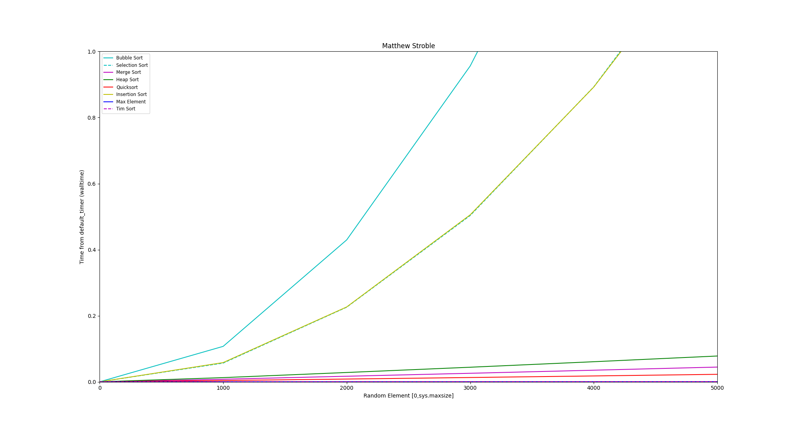
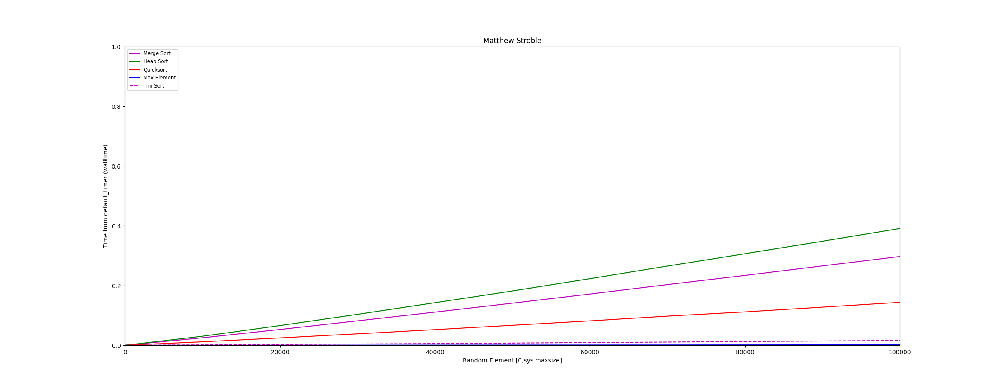

# Benchmark-Sorting-Algorithms
testing framework for Benchmarking sorting algorithms

The main idea for this is to see what the timings of each sorting algorithm looks like graphed out. The program at each step size generates an array for the current step size, that array can be randomly generated or worst case scenario depending on the options set. The below figures are random arrays. For each step a random array of a given step length is generated and saved as a master array. This is then copied for each sorting algorithm to solve so each step is sorting the same random array for the set being tested. I was interested in looking at how each sorting algorithm sorts and its time effecency when compairing the same array.

This is a sample run i did for all of the supported algorithms. This is solving an array size from 0 to 5000 in steps of 1000 for a set with each set being solved 100 times to remove any processor variances in loads and timings. 

This run i had to disable the Insertion, Selection and bubble sort as it would just take way to long to complete the run. This figure is running random arrays from 0 to 100,000 integers in steps of 10,000 with each set being tested 100 times to get an average time for that set to remove any varriances in processor timing of other programs running.

